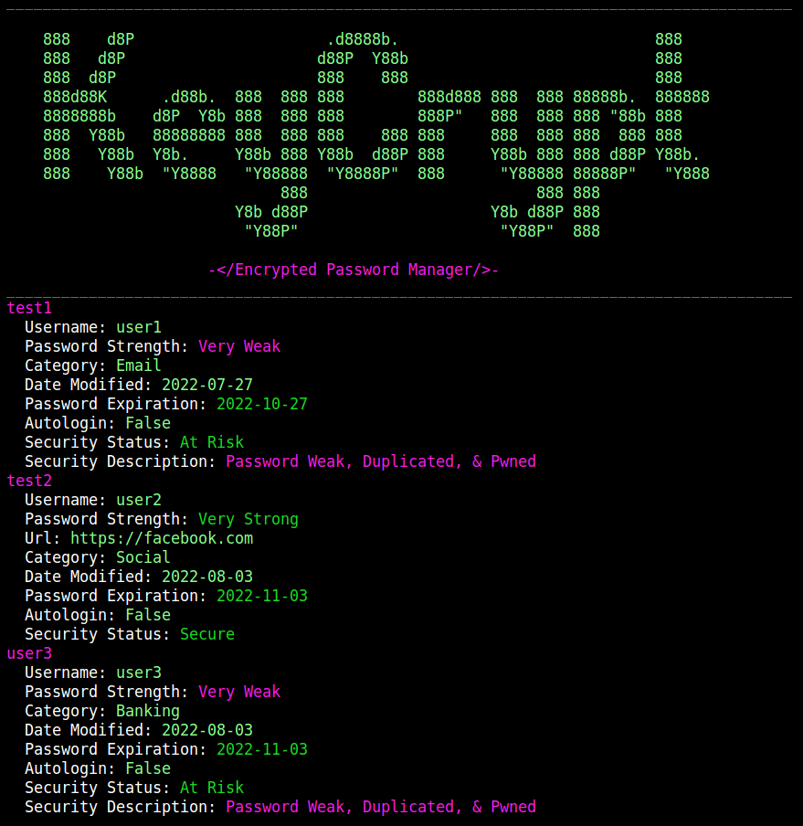

# KeyCrypt
Encrypted Password Manager

---

Copyright 2022, Akshay R. Kapadia 
License: GPL-3.0 
Version: 0.2.0 
Status: Development 

---

---

## Features
1. GNU Privacy Guard encryption
2. Encrypted data stored locally on your computer
3. Automatically checks haveibeenpwned.com to see if your account has been breached or your password has been pwned
4. Tests password strength by calculating the entropy value of the password
5. Gives warning if password is about to expire, is not strong enough, or is reused for other accounts
6. Can work in restricted mode if there is no wifi available or wifi permission is denied

---

## Commands

1. **add** {name} - add a new account to the keycrypt
  * *-r, --random* {length} - randomly generates a password of the specified length

2. **delete** {name} - permanently delete an account from the keycrypt

3. **edit** {name} - edit an existing account in the keycrypt
  * *-pv, --password-visible* - makes the password visible when the account data is shown

4. **find** {name} - find an account stored in the keycrypt
  * *-pv, --password-visible* - makes the password visible when the account data is shown

5. **see** {category} - see all the accounts in a specific category
  * *-pv, --password-visible* - makes the password visible when the account data is shown

6. **backup** {path} - backs up data to the specified directory (absolute path)
  * *-d, --delete* - deletes the original copy of the data

7. **restore** {path} - restores data from the specified directory (absolute path)
  * *-d, --delete* - deletes the original copy of the data
  * *-m --merge* - merges current KeyCrypt data with another backup of the data

8. **settings** - Can revoke wifi permission and set default password visibility

9. **nuke** - permanently erases all keycrpyt data from the computer

---

All Breach Data Is From haveibeenpwned.com
